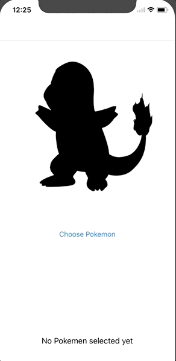
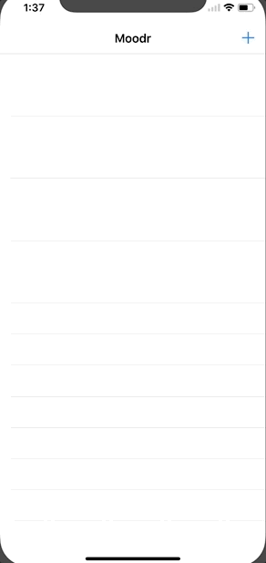
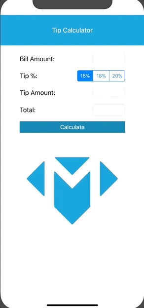

# Make School's Mobile 1 / Swift Course

## Class Overview
Fundamental to intermediate course on Swift, Xcode and IOS development.

## Lessons
* Delegation
* Protocols
* Closures
* ARC
* OOP
* Enums
* Structs
___

## Class Projects:
 
#### Guess Pokemon App
 

 
 
Used delegation to pass user's guess from one table view controller to another
 
 
#### Mood Tracker App
 

 
 
Used delegation to pass name and emoji selection from one table view controller to another
 
 
#### Tip Calculator App
 

 
 
Minimalistic calculator with a beautiful UI that allows you to compute a tip based on a bill amount.
 
#### Tip Calculator App
 
 

 
 
Simple animation app built to learn how to use view controllers, segues, IBActions, IBOutlets and animations in Swift / Xcode.
 
